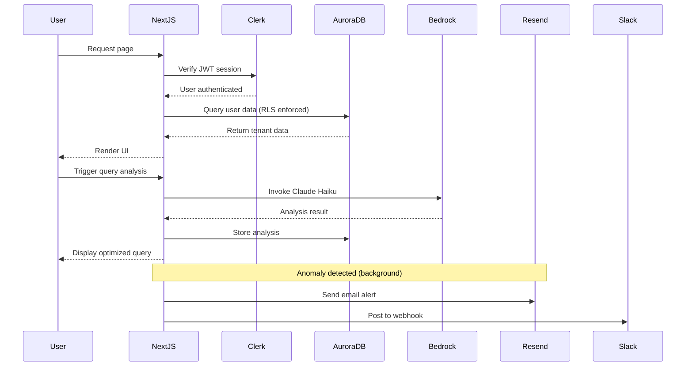

# 🛠️ AuroraGuard — Technical Requirements Document (TRD)

**Document Version:** 1.0  
**Date:** 2026-06-17  
**Author:** Product Architect / Full-Stack Engineer  
**Project:** AuroraGuard – AI-Powered Database Cost & Performance Guardian  
**Hackathon:** H0: Hack the Zero Stack  
**Track:** Track 2 – Monetizable B2B Application  

---

## 1. Introduction

### 1.1 Purpose
This Technical Requirements Document (TRD) defines the detailed technical specifications, architecture, components, interfaces, and constraints for the AuroraGuard platform. It translates the product requirements (PRD) and functional requirements (FR) into actionable engineering specifications for the development team.

### 1.2 Scope
The document covers the complete technical stack of the MVP delivered for the H0 hackathon, including:
- Frontend application (Next.js on Vercel)
- Backend API (Next.js API Routes / tRPC)
- Database (Amazon Aurora PostgreSQL)
- AI Integration (Amazon Bedrock)
- Authentication (Clerk)
- Notifications (Resend, Slack webhooks)
- Deployment and operations

All components must operate within a **$0.00 budget** using AWS free tier, Vercel Hobby, and hackathon credits.

---

## 2. System Architecture

### 2.1 High-Level Architecture Diagram

```
┌─────────────────────────────────────────────────────────────────────┐
│                           USER BROWSER                                │
│  ┌──────────────┐  ┌──────────────┐  ┌──────────────┐               │
│  │  Dashboard   │  │  Query       │  │  Alerts      │               │
│  │  (Recharts)  │  │  Optimizer   │  │  Panel       │               │
│  └──────┬───────┘  └──────┬───────┘  └──────┬───────┘               │
└─────────┼─────────────────┼─────────────────┼───────────────────────┘
          │                 │                 │
          ▼                 ▼                 ▼
┌─────────────────────────────────────────────────────────────────────┐
│                        VERCEL EDGE NETWORK                            │
│  ┌──────────────────────────────────────────────────────────────┐   │
│  │  Next.js 14 App Router                                       │   │
│  │  ┌───────────┐  ┌───────────┐  ┌───────────┐  ┌───────────┐ │   │
│  │  │ Pages     │  │ API Routes│  │ Edge      │  │ Middleware│ │   │
│  │  │ (SSR/ISR) │  │ (tRPC)    │  │ Functions │  │ (Clerk)   │ │   │
│  │  └───────────┘  └─────┬─────┘  └───────────┘  └───────────┘ │   │
│  └────────────────────────┼──────────────────────────────────────┘   │
└─────────────────────────────┼─────────────────────────────────────────┘
                              │
                              ▼
┌─────────────────────────────────────────────────────────────────────┐
│                          AWS CLOUD (Free Tier)                        │
│                                                                       │
│  ┌───────────────────────┐     ┌──────────────────────────────┐     │
│  │   AWS Lambda (future) │     │   Amazon Bedrock              │     │
│  │   Query Log Poller    │     │   Claude 3 Haiku              │     │
│  └───────────────────────┘     └──────────────────────────────┘     │
│                                                                       │
│  ┌──────────────────────────────────────────────────────────────┐   │
│  │  Amazon Aurora PostgreSQL (db.t4g.medium, 20GB)              │   │
│  │  Extensions: pg_stat_statements, pgvector, uuid-ossp         │   │
│  │  ┌─────────────┐  ┌─────────────┐  ┌─────────────┐          │   │
│  │  │ Users       │  │ Queries     │  │ Analyses    │          │   │
│  │  │ (RLS)       │  │ (Partitioned│  │ (pgvector)  │          │   │
│  │  └─────────────┘  └─────────────┘  └─────────────┘          │   │
│  └──────────────────────────────────────────────────────────────┘   │
│                                                                       │
│  ┌───────────────────────────────┐                                  │
│  │  External Services            │                                  │
│  │  - Resend (email)             │                                  │
│  │  - Slack/Discord Webhooks     │                                  │
│  │  - Stripe (test mode)         │                                  │
│  └───────────────────────────────┘                                  │
└─────────────────────────────────────────────────────────────────────┘
```

### 2.2 Component Interaction Diagram



### 2.3 Deployment Architecture

```
GitHub Repository
    │
    │ git push
    ▼
Vercel (Git Integration)
    │
    ├── Build: Next.js (npm run build)
    ├── Deploy: Serverless Functions
    └── Environment Variables injected
```

---

## 3. Technology Stack Specification

### 3.1 Frontend

| Component | Technology | Version | Justification |
|-----------|------------|---------|---------------|
| Framework | Next.js | 14.x (App Router) | Required by hackathon, SSR/ISR support |
| Language | TypeScript | 5.x | Type safety, better DX |
| Styling | Tailwind CSS | 3.x | Utility-first, rapid prototyping |
| Component Library | shadcn/ui | Latest | Accessible, customizable, Tailwind-native |
| Icons | lucide-react | Latest | Consistent icon set |
| Charts | Recharts | 2.x | React-native, lightweight, SVG-based |
| Data Fetching | SWR | 2.x | Stale-while-revalidate, caching, polling |
| State Management | React Context + SWR cache | — | No heavy state library needed |
| Code Highlighting | None for MVP | — | Plain monospace text; future: Shiki |

### 3.2 Backend

| Component | Technology | Version | Justification |
|-----------|------------|---------|---------------|
| API Layer | Next.js API Routes + tRPC | Next.js 14 / tRPC 10 | End-to-end type safety, colocated with frontend |
| ORM | Drizzle ORM (or Prisma) | Latest | SQL-like syntax, lightweight, good with pg |
| Database Driver | `pg` (node-postgres) | 8.x | Direct connection to Aurora |
| Authentication | Clerk | Latest | Quick integration, 10k MAU free |
| AI SDK | `@aws-sdk/client-bedrock-runtime` | 3.x | Official AWS SDK for Bedrock |
| Email | Resend | Latest | 100 emails/day free |
| Payments | Stripe | Latest | Test mode free |

### 3.3 Database

| Component | Technology | Specification |
|-----------|------------|---------------|
| Primary DB | Amazon Aurora PostgreSQL | db.t4g.medium, 2 vCPU, 4GB RAM, 20GB storage |
| Extensions | pg_stat_statements, pgvector, uuid-ossp, pgcrypto | Required for query tracking, vector search, encryption |
| Partitioning | Declarative partitioning by RANGE (monthly) | On `captured_queries` table |
| Security | Row-Level Security (RLS) | Multi-tenant isolation using `app.current_clerk_id` |

### 3.4 External Services

| Service | Purpose | Free Tier Limit |
|---------|---------|-----------------|
| Vercel | Hosting, Edge Functions | 100GB bandwidth, 6000 build minutes |
| Clerk | Authentication | 10,000 monthly active users |
| AWS Bedrock | AI query analysis | Hackathon credits provided |
| AWS Lambda | Future: query log polling | 1M requests/month free |
| Resend | Email notifications | 100 emails/day |
| Stripe | Payment processing | Test mode unlimited |
| Slack/Discord | Alert webhooks | Free webhook URLs |

---

## 4. Database Technical Specifications

### 4.1 Instance Configuration

```yaml
DB Instance Class: db.t4g.medium
Engine: aurora-postgresql (compatible with PostgreSQL 15.x)
Storage: 20 GB (General Purpose SSD, auto-scaling disabled for free tier)
Multi-AZ: false (single AZ for free tier)
Backup Retention: 1 day (minimum for free tier)
Encryption: Enabled at rest (default AES-256)
Public Accessibility: Yes (for direct connection during development; restrict in production)
```

### 4.2 Connection Pooling

- Use `pg` pool with max 5 connections (free tier memory limit).
- Configure `idleTimeoutMillis: 30000`, `connectionTimeoutMillis: 5000`.
- No PgBouncer needed for MVP (single instance, low concurrency).

### 4.3 Schema Indexing Strategy

| Table | Index | Type | Purpose |
|-------|-------|------|---------|
| `users` | `clerk_id` | B-tree unique | Fast user lookup by Clerk ID |
| `users` | `email` | B-tree unique | Email lookups |
| `db_connections` | `user_id` | B-tree | List connections per user |
| `captured_queries` | `connection_id` | B-tree | Filter queries by connection |
| `captured_queries` | `query_hash` | B-tree | Deduplication |
| `captured_queries` | `avg_time_ms DESC` | B-tree | Top slow queries |
| `captured_queries` | `captured_at DESC` | B-tree | Time-based filtering |
| `captured_queries` | `is_expensive` (partial) | Partial B-tree | Quick expensive query filtering |
| `query_analyses` | `query_id` | B-tree | Join with query |
| `query_analyses` | `embedding` | IVFFlat (pgvector) | Similar query matching |
| `cost_alerts` | `user_id` | B-tree | User's alerts |
| `cost_alerts` | `created_at DESC` | B-tree | Recent alerts first |
| `cost_alerts` | `resolved` (partial) | Partial B-tree | Unresolved alerts |

### 4.4 Partitioning Strategy

```sql
-- Monthly partitioning on captured_queries
CREATE TABLE captured_queries_2026_06 PARTITION OF captured_queries
FOR VALUES FROM ('2026-06-01') TO ('2026-07-01');

CREATE TABLE captured_queries_2026_07 PARTITION OF captured_queries
FOR VALUES FROM ('2026-07-01') TO ('2026-08-01');
```
For production, a scheduled job creates future partitions and detaches old ones.

### 4.5 Row-Level Security Setup

```sql
-- Enable RLS on all tenant tables
ALTER TABLE users ENABLE ROW LEVEL SECURITY;
ALTER TABLE db_connections ENABLE ROW LEVEL SECURITY;
-- ... for all tables

-- Create policies using app.current_clerk_id
CREATE POLICY user_isolation ON users
    USING (clerk_id = current_setting('app.current_clerk_id'));

-- The app sets this at session start:
SELECT set_config('app.current_clerk_id', $clerk_id, false);
```

---

## 5. API Technical Specifications

### 5.1 API Architecture

- **Protocol:** HTTPS only
- **API Style:** RPC-style via tRPC (or RESTful if tRPC not feasible)
- **Content Type:** `application/json`
- **Authentication:** Clerk JWT in Authorization header; validated by middleware
- **Rate Limiting:** Basic Vercel Edge Middleware rate limiter (100 requests/15 min per user)

### 5.2 tRPC Router Structure

```typescript
// server/api/root.ts
const appRouter = router({
  connection: connectionRouter,   // CRUD for db_connections
  query: queryRouter,            // Query list, detail, analysis
  optimizer: optimizerRouter,    // Ad-hoc query analysis
  alert: alertRouter,            // Alert list, ack/resolve
  report: reportRouter,          // PDF generation
  user: userRouter,              // Profile, preferences
  billing: billingRouter,        // Stripe checkout/portal
});

export type AppRouter = typeof appRouter;
```

### 5.3 Key Endpoint Specifications

#### 5.3.1 Query Optimization

```
Endpoint: POST /api/trpc/optimizer.analyze
Request Body:
{
  query: string;        // SQL query text
  dbType: string;       // 'aurora_postgresql' | 'dynamodb' | ...
  schemas?: string;     // Optional DDL
}

Response (200):
{
  id: string;           // Unique analysis ID
  riskLevel: "critical" | "high" | "medium" | "low";
  riskScore: number;    // 0-10
  issues: Array<{
    type: string;
    severity: string;
    description: string;
    impact: string;
  }>;
  optimizedQuery: string;
  improvementPercent: number;
  recommendations: Array<{
    action: string;
    description: string;
    ddl?: string;
  }>;
  estimatedSavings: number;
}

Error Responses:
- 400: Invalid query input
- 429: Rate limit exceeded (free plan: 3/day)
- 500: Bedrock API error (retry suggested)
```

#### 5.3.2 Alert Acknowledgment

```
Endpoint: POST /api/trpc/alert.acknowledge
Request Body:
{
  alertId: string;
}

Response (200):
{
  acknowledged: true;
  acknowledgedAt: string; // ISO timestamp
}

Side effects:
- Updates alert record
- Logs activity
```

#### 5.3.3 Report Generation

```
Endpoint: POST /api/trpc/report.generate
Request Body:
{
  connectionId: string;
  dateRange: { start: string; end: string; };
  sections: string[];  // ['queries', 'costs', 'alerts', 'recommendations']
}

Response (200):
{
  reportUrl: string;   // Temporary signed URL for PDF download
  expiresAt: string;
}
```

### 5.4 Error Handling Standard

All API errors follow a consistent format:
```json
{
  "error": {
    "code": "QUERY_ANALYSIS_FAILED",
    "message": "The AI model was unable to process this query. Please try again.",
    "details": { "model": "claude-3-haiku", "retryable": true }
  }
}
```

---

## 6. Frontend Technical Specifications

### 6.1 Project Structure

```
auroraguard/
├── app/
│   ├── (auth)/
│   │   ├── sign-in/[[...sign-in]]/page.tsx
│   │   ├── sign-up/[[...sign-up]]/page.tsx
│   │   └── layout.tsx
│   ├── (dashboard)/
│   │   ├── dashboard/
│   │   │   ├── page.tsx
│   │   │   ├── connections/
│   │   │   │   ├── page.tsx
│   │   │   │   └── [id]/page.tsx
│   │   │   ├── optimizer/page.tsx
│   │   │   ├── alerts/page.tsx
│   │   │   ├── settings/page.tsx
│   │   │   └── layout.tsx
│   │   └── layout.tsx
│   ├── (public)/
│   │   ├── page.tsx (landing)
│   │   ├── pricing/page.tsx
│   │   └── layout.tsx
│   ├── api/
│   │   ├── trpc/[trpc]/route.ts
│   │   └── webhooks/
│   │       ├── clerk/route.ts
│   │       └── stripe/route.ts
│   └── layout.tsx
├── components/
│   ├── ui/            (shadcn/ui components)
│   ├── layout/
│   │   ├── sidebar.tsx
│   │   ├── header.tsx
│   │   └── mobile-nav.tsx
│   ├── dashboard/
│   │   ├── health-card.tsx
│   │   ├── cost-chart.tsx
│   │   └── query-table.tsx
│   ├── optimizer/
│   │   ├── query-input.tsx
│   │   └── analysis-result.tsx
│   └── alerts/
│       └── alert-card.tsx
├── lib/
│   ├── bedrock.ts
│   ├── db.ts
│   ├── resend.ts
│   └── utils.ts
├── server/
│   └── api/
│       ├── root.ts
│       ├── trpc.ts
│       └── routers/
│           ├── connection.ts
│           ├── query.ts
│           ├── optimizer.ts
│           ├── alert.ts
│           ├── report.ts
│           ├── user.ts
│           └── billing.ts
├── prisma/
│   └── schema.prisma  (or drizzle schema)
├── public/
├── .env.local.example
├── next.config.js
├── tailwind.config.ts
├── tsconfig.json
└── package.json
```

### 6.2 Component State Management

Each component must handle four states:

| State | Implementation |
|-------|----------------|
| **Loading** | `<Skeleton />` or `Spinner` |
| **Empty** | Descriptive message + illustration icon |
| **Error** | Error card with retry button |
| **Data** | Render actual content |

### 6.3 Responsive Breakpoints

```typescript
// tailwind.config.ts breakpoints (default)
screen: {
  'sm': '640px',   // Mobile landscape
  'md': '768px',   // Tablet
  'lg': '1024px',  // Desktop
  'xl': '1280px',  // Large desktop
}
```

Sidebar behavior:
- `>= md`: Fixed sidebar (240px)
- `< md`: Sidebar collapses; hamburger menu triggers `Sheet` drawer

### 6.4 Chart Configuration

**Recharts LineChart** (Cost Trend):
```tsx
<LineChart data={costData}>
  <XAxis dataKey="day" stroke="#94A3B8" />
  <YAxis stroke="#94A3B8" />
  <Tooltip contentStyle={{ backgroundColor: '#1E293B', border: '1px solid #334155' }} />
  <Line type="monotone" dataKey="cost" stroke="#3B82F6" strokeWidth={2} dot={{ fill: '#3B82F6' }} />
</LineChart>
```

**Recharts PieChart** (Query Distribution):
```tsx
<PieChart>
  <Pie data={queryDist} dataKey="value" nameKey="type" cx="50%" cy="50%" innerRadius={60} outerRadius={80}>
    {queryDist.map((entry, index) => (
      <Cell key={index} fill={COLORS[index]} />
    ))}
  </Pie>
  <Tooltip />
</PieChart>
```

---

## 7. AI Integration Technical Specifications

### 7.1 Bedrock Model Configuration

```typescript
const MODEL_ID = "anthropic.claude-3-haiku-20240307-v1:0";
const MAX_TOKENS = 1024;        // Limit to control costs
const TEMPERATURE = 0.1;        // Low for consistent, factual outputs
const TOP_P = 0.9;
```

### 7.2 Prompt Template (Query Optimizer)

```
System: You are an expert database administrator. Analyze the following {dbType} query and return ONLY valid JSON (no other text).

User Query:
{query}

Table Schemas (if provided):
{schemas}

Return JSON format:
{
  "risk_level": "critical|high|medium|low|optimal",
  "risk_score": 0-10,
  "issues": [
    {
      "type": "missing_index|select_star|full_scan|...",
      "severity": "high|medium|low",
      "description": "Clear explanation",
      "impact": "Performance/cost impact"
    }
  ],
  "optimized_query": "optimized SQL",
  "improvement_percent": number,
  "recommendations": [
    {
      "action": "create_index|rewrite_query|...",
      "description": "...",
      "ddl": "SQL DDL if applicable"
    }
  ],
  "explanation": "Brief plain-English summary"
}
```

### 7.3 Caching Strategy

- **In-memory LRU cache** with 30-minute TTL.
- Key: `${dbType}:${normalizedQuery}`.
- Reduces Bedrock calls, staying well within hackathon credits.

### 7.4 Error Recovery

- Bedrock timeout (5s): show fallback "Analysis timed out, try with a simpler query".
- Invalid JSON response: retry once with stricter prompt; if fails again, show generic error.
- Service unavailable: display cached last analysis if exists, else full error.

---

## 8. Security Technical Implementation

### 8.1 Authentication Flow

1. User authenticates via Clerk (email/password or Google).
2. Clerk issues a short-lived JWT (stored in httpOnly cookie).
3. Next.js middleware validates JWT on every request.
4. On successful validation, the middleware decodes user ID and sets `app.current_clerk_id` in the database session for RLS.

### 8.2 Database Credentials

- Aurora password stored in Vercel environment variable.
- Connection uses TLS (`ssl: { rejectUnauthorized: true }`).
- No database credentials exposed to the client.

### 8.3 API Security

- All API routes are protected by Clerk middleware (except webhooks).
- CSRF protection: Clerk handles; Next.js built-in via `SameSite` cookies.
- Input validation: All inputs validated with `zod` schemas in tRPC procedures.
- SQL injection prevention: Use parameterized queries via ORM; never string concatenation.

---

## 9. Performance & Scalability Technical Requirements

### 9.1 Frontend Performance

| Metric | Target | Implementation |
|--------|--------|----------------|
| First Contentful Paint (FCP) | < 1.5s | SSG for landing page, SSR for dashboard |
| Largest Contentful Paint (LCP) | < 2.5s | Optimize font loading, defer charts |
| Time to Interactive (TTI) | < 3s | Code splitting by route |
| Cumulative Layout Shift (CLS) | < 0.1 | Reserve space for async content |

**Techniques:**
- Next.js `<Image>` for any future images (none for MVP).
- Dynamic import for charts (`next/dynamic` with `ssr: false`).
- SWR with `revalidateOnFocus: false` to reduce unnecessary fetches.

### 9.2 Backend Performance

| Metric | Target | Implementation |
|--------|--------|----------------|
| API response time (p95) | < 500ms | Database connection pooling, query optimization |
| Bedrock latency | < 5s | Caching, retry logic |
| PDF generation | < 3s | Server-side with streaming |

### 9.3 Database Performance

- All queries must use indexes (verified by `EXPLAIN ANALYZE`).
- Partition pruning on `captured_queries` for time-based queries.
- `pg_stat_statements` monitored for query patterns.

---

## 10. Deployment & DevOps

### 10.1 CI/CD Pipeline

```yaml
# vercel.json
{
  "buildCommand": "npx prisma generate && next build",
  "installCommand": "npm install",
  "framework": "nextjs"
}
```

On each push to `main` branch:
1. Vercel triggers build.
2. Prisma client generated.
3. Next.js build (SSG/SSR pages compiled).
4. Deployed to `https://auroraguard.vercel.app`.

### 10.2 Environment Variables on Vercel

All `.env.local` variables must be set in Vercel dashboard:
- Production, Preview, and Development environments.

### 10.3 Database Migrations

```bash
# Run migrations manually (no CI auto-migration to protect data)
npx drizzle-kit push:pg  # or npx prisma db push
```

For the hackathon, schema can be applied directly via SQL script.

### 10.4 Rollback Strategy

- Vercel instant rollback to previous deployment.
- Database: no automatic rollback; manual SQL restore from backup if needed.

---

## 11. Monitoring & Observability

### 11.1 Logging

- Next.js server logs: captured by Vercel.
- API errors: logged with timestamp, user ID, error details.
- Bedrock API calls: logged with query hash and latency.

### 11.2 Analytics

- Vercel Analytics for page views and Core Web Vitals.
- Custom events: query analysis triggered, alert acknowledged, report generated.

### 11.3 Alerts (for the development team, not users)

- Not needed for hackathon; use Vercel deployment notifications.

---

## 12. Constraints & Assumptions

### 12.1 Zero-Cost Constraints

| Service | Constraint | Mitigation |
|---------|------------|------------|
| Aurora | db.t4g.medium only | Seed data is minimal (~111MB); no production load |
| Vercel | 100GB bandwidth | No images; static assets minimal |
| Bedrock | Credits from hackathon | Aggressive caching; limit daily usage |
| Clerk | 10,000 MAU | Hackathon demo only |

### 12.2 Hackathon-Specific Assumptions

- Real query log streaming is simulated with seed data.
- No actual customer AWS databases are connected.
- Stripe integration remains in test mode for the demo.
- Alerts are generated on demand, not via real continuous monitoring.

---

## 13. Testing Strategy

| Test Type | Scope | Tools |
|-----------|-------|-------|
| Unit Tests | Utility functions, Bedrock prompt parsing | Vitest / Jest |
| API Tests | tRPC endpoint responses | MSW + React Testing Library |
| E2E Tests | Critical user journeys (signup → dashboard → optimize) | Playwright (optional for MVP) |
| Load Tests | 50 concurrent users | k6 (quick script) |

---

## 14. Appendices

- **Appendix A:** Complete database schema SQL
- **Appendix B:** Environment variables template
- **Appendix C:** tRPC router code examples
- **Appendix D:** v0 prompt library
- **Appendix E:** Seed data SQL script

---

**Document Approval**

| Role | Name | Signature | Date |
|------|------|-----------|------|
| Product Architect | | | |
| Lead Engineer | | | |
| Product Designer | | | |
